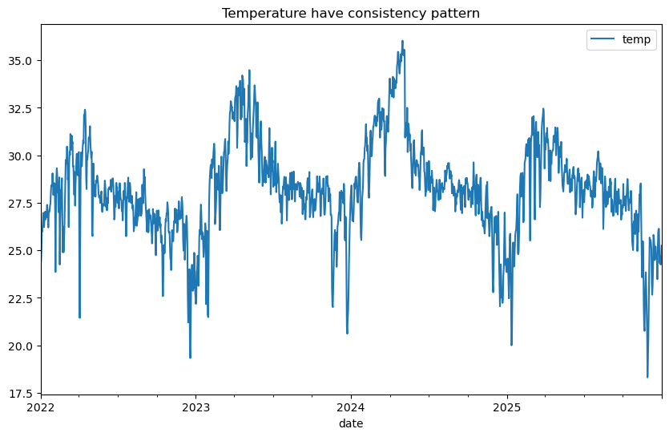
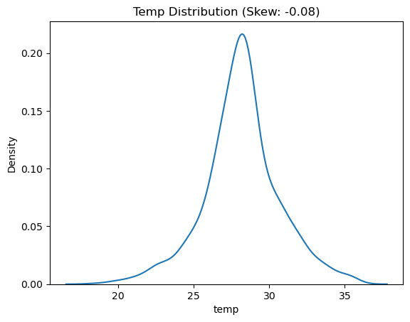
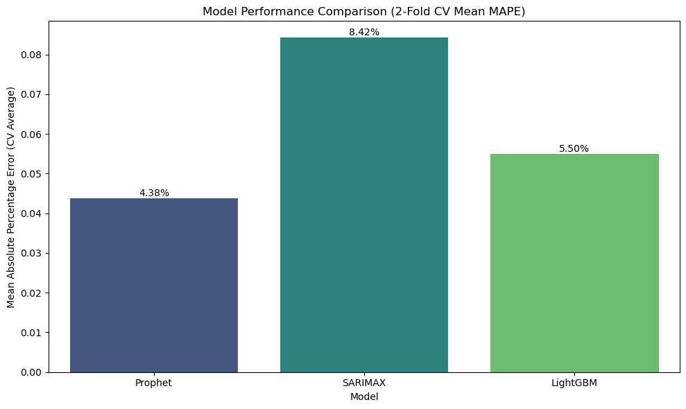
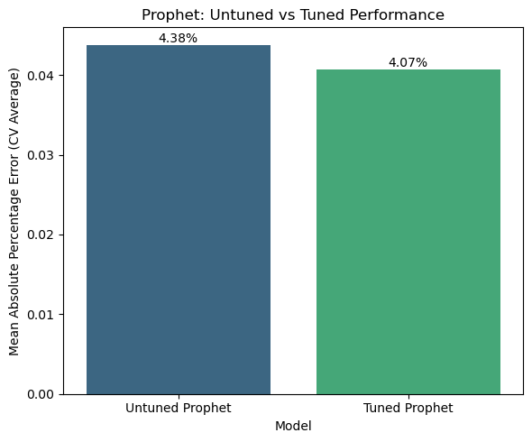
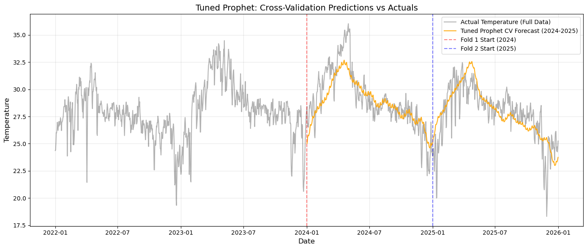
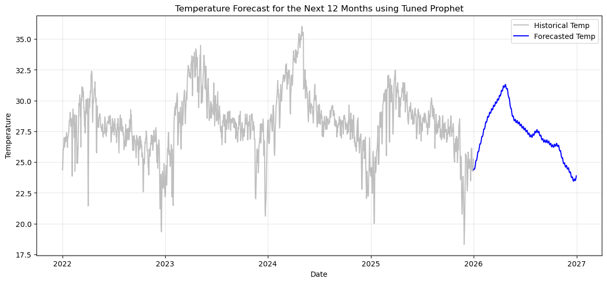
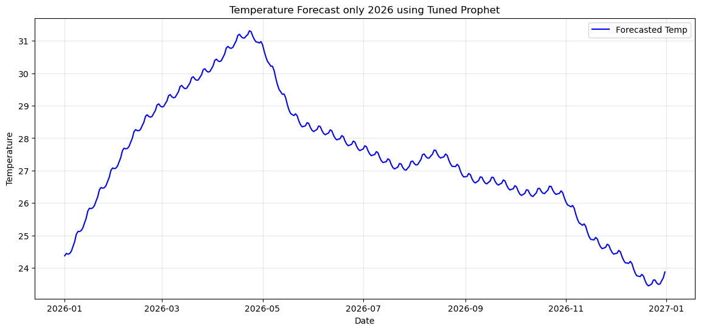
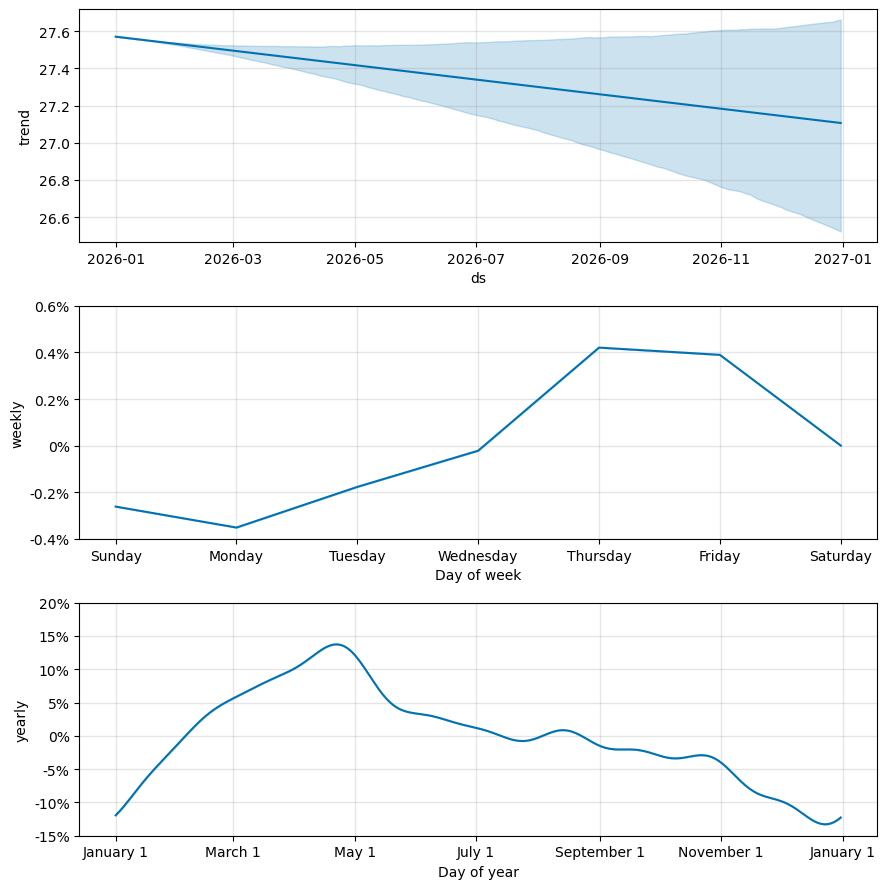

# Thailand Temperature Forecasting

## Objective
This project helps businesses, agricultural planners, and policymakers in Thailand anticipate weather patterns and plan their operations effectively by providing a highly accurate 12-month temperature forecast. The primary goal is to analyze historical climate data, uncover underlying seasonal trends, and build a robust time-series forecasting model to predict future temperatures.

## Project Overview
* **Data Preparation:** Cleaned and verified daily temperature records (2022-2025) to ensure a complete dataset with no missing values.
* **Exploratory Data Analysis (EDA):** Identified highly consistent, normally distributed seasonal temperature patterns.
* **Model Building:** Engineered time-based features (including Fourier terms and lags) and evaluated Prophet, SARIMAX, and LightGBM algorithms.
* **Model Performance:** Selected the Tuned Prophet model as the optimal approach, achieving an impressive 4.07% CV MAPE and revealing a slight downward cooling trend for 2026.

## Resources Used
* **Language:** Python
* **Libraries & Packages:** pandas, numpy, matplotlib, seaborn, kagglehub, scikit-learn, prophet, statsmodels, pmdarima, lightgbm, optuna
* **Tools:** Jupyter Notebook

## Project Features Explanation
The dataset used in this project is the **Thailand Weather 2022 - 2025** dataset sourced from NASA via Kaggle. The key features are:
* **Date:** The specific date of the recorded weather observation (spanning daily from January 2022 to December 2025).
* **Mean_Temp:** The average temperature recorded on that day in Thailand, measured in degrees Celsius.

## Data Cleaning
To prepare the raw NASA dataset for time-series modeling, the following preprocessing steps were performed:
* Retained only the essential columns: `Date` and `Mean_Temp`.
* Standardized all column headers by converting them to lowercase and stripping whitespace.
* Renamed `mean_temp` to `temp` for simplicity.
* Converted the date column to a proper datetime format and set it as the dataset's index.
* Validated the dataset for completeness, confirming there were zero missing values, which meant no data imputation was necessary.

## Exploratory Data Analysis (EDA)
During the exploratory phase, the data revealed consistent patterns:
* The overall average temperature in the dataset is 28.17°C, with a minimum of 18.31°C and a maximum of 36.03°C.
* A visual inspection of the time series showed a very consistent and repeating seasonal pattern across all observed years.

* The temperature distribution is nearly perfectly normal with a skewness score of -0.08. Because the data is not heavily skewed, mathematical transformations (like log transforms) were unnecessary prior to modeling.

## Model Building & Feature Engineering
To capture the complex seasonality and trends in the weather data, several different modeling approaches were tested.

**Feature Engineering:**
* For Prophet, the target columns were formatted to `ds` (date) and `y` (temperature) to meet the library's specific requirements.
* For the SARIMAX and LightGBM models, Fourier terms (period=365.25, order=4) were mathematically generated to represent the yearly seasonality.
* For LightGBM, additional time-based features were engineered, including a 365-day lag (`lag_365`), `day_of_year`, `month`, and `day_of_week`, to provide the tree-based model with necessary temporal context.

**Models Used:**
* **Facebook Prophet:** Selected as the primary forecasting approach because it natively handles complex daily, weekly, and yearly seasonality. Both a baseline model and a version tuned using Optuna (to optimize changepoint and seasonality scales) were evaluated.
* **SARIMAX:** A traditional statistical time-series model. It was built using the engineered Fourier terms as exogenous variables to manage the strong annual seasonality.
* **LightGBM:** A powerful gradient boosting machine learning framework. It was trained using the engineered date-features, lag features, and Fourier terms to capture non-linear temporal relationships.

## Model Performance
The models were evaluated using Cross-Validation Mean Absolute Percentage Error (CV MAPE) over a 365-day horizon.

* **Baseline Prophet:** CV MAPE = 4.38%
* **SARIMAX:** CV MAPE = 8.42%
* **LightGBM:** CV MAPE = 5.50%

After hyperparameter tuning via Optuna, the **Tuned Prophet** model achieved an even better **CV MAPE of 4.07%**.

**Final Forecast & Insights:**

Using the Tuned Prophet model to forecast the next 12 months revealed several key insights:
* **Yearly Trends:** Temperatures peak sharply between late April and early May, and drop to their lowest point from late December to January.
* **Weekly Trends:** Temperatures are generally higher on Thursdays and Fridays, and lowest on Mondays.
* **2026 Outlook:** The model predicts a slight overall downward cooling trend throughout 2026.

